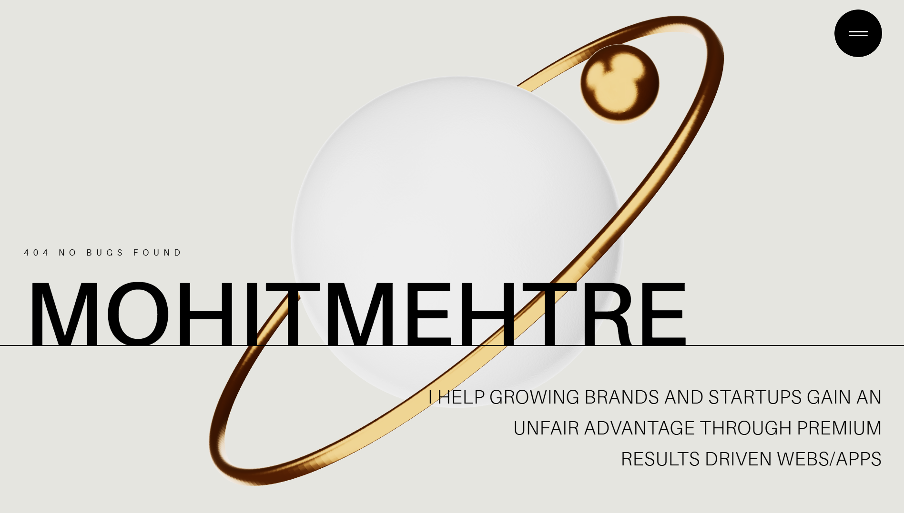
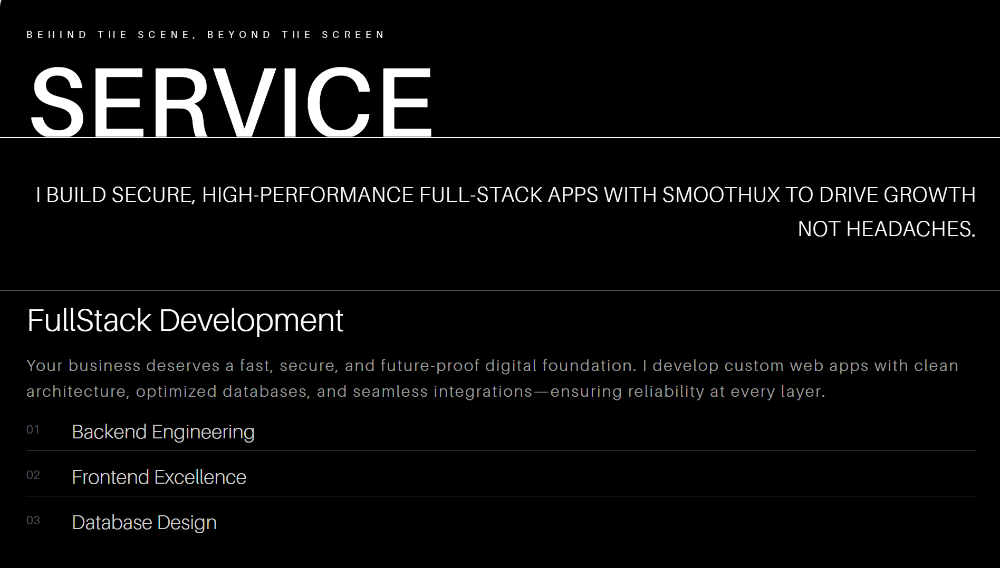
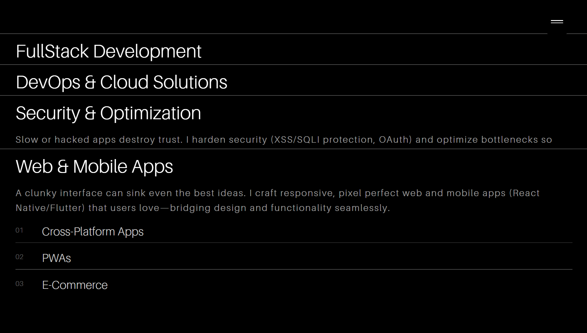
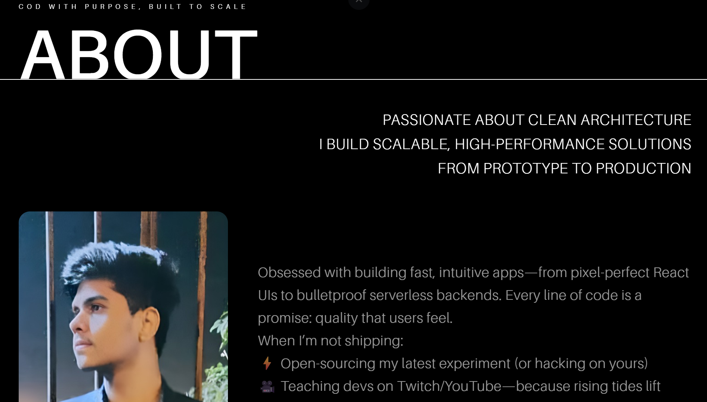
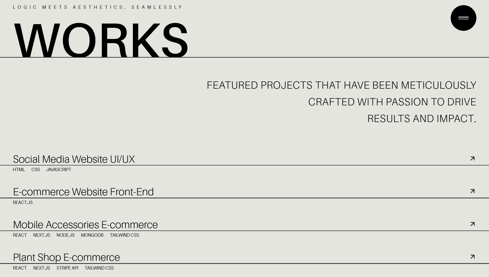
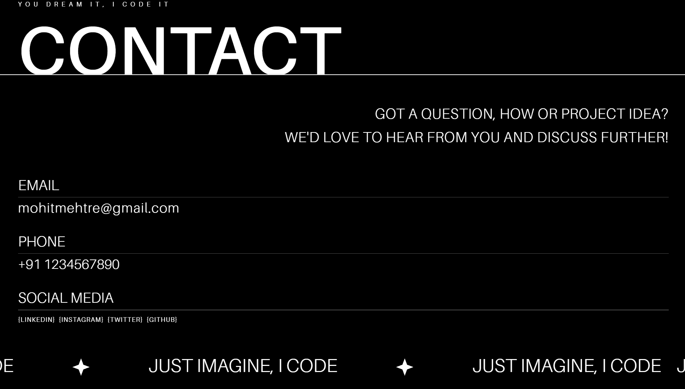

# 🖥️ Portfolio Design (Showcase)

A modern, animated, and fully responsive portfolio concept built with **React**, **Tailwind CSS**, and **Vite**.  
Features smooth scrolling, 3D hero scenes, and scroll-triggered animations for an engaging browsing experience.

> ⚠️ This repository contains **only media & documentation** for showcase purposes.  
> The source code is private and not available for cloning, reuse, or redistribution.  
> This design is inspired by online resources and adapted for personal learning.

---

## 🚀 Live Demo
🔗 [portfolio-design-mohit.netlify.app](https://portfolio-design-mohit.netlify.app/)

---

## 📸 Preview

### 🏠 Home Section

---

### ℹ️ Info Section

---

### 💼 Services Section

---

### 💼 all Services Section

---

### 👤 About Section

---

### 🛠️ Work Section

---

### ✉️ Contact Section

---

## ✨ Highlights

- Responsive Navbar with **GSAP** animations
- **3D Hero Scene** with React Three Fiber & Drei
- Scroll-triggered animations (**Tailwind + GSAP**)
- Interactive project previews & contact marquees
- Smooth scroll with **Lenis**
- Optimized for performance & accessibility

---

## 🧠 Tech Stack

- **React**  
- **Tailwind CSS**  
- **Vite**  
- **GSAP**  
- **Lenis**  
- **Three.js** + **React Three Fiber** + **Drei**  
- **Iconify**

---

## 🙋‍♂️ Author

**Mohit Mehtre**  
📍 [GitHub Profile](https://github.com/mohitmehtre)
